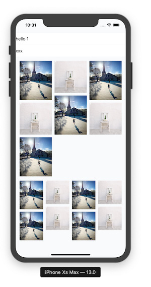

# LegoKit


使用 Swift 5.1 @_functionBuilder 特性, 通过类似 SwiftUI 的方式组装复杂的 CollectionView

支持 `if` `ForIn` 特性





## Usage


```swift
class VC: UIViewController {
  // 组装
	lazy var lego: Lego = {
        Lego {
            Section(layout:layout1 ) {
                XItem(value: "hello 1")
                if self.flag {
                    XItem(value: "xxx")
                }
            }
            
            ForIn(3...4) { x in
                Section(layout:FlowLayout(col: x)) {
                    ForIn(0...(x + 3)) { y in
                        ImageItem(value: UIImage(named: "\(y % 2)")!)
                    }
                }
            }
        }
    }()
  
    lazy var renderer: LegoRenderer = {
        return LegoRenderer(lego: self.lego)
    }()
  
    override func viewDidLoad() {
        super.viewDidLoad()
        renderer.use(itemType: XItem.self)
      	renderer.use(itemType: ImageItem.self)
        renderer.render(in: self.view) 
    }
}
```


## TODO

- [ ] Sticky Header
- [ ] HostingViewController

